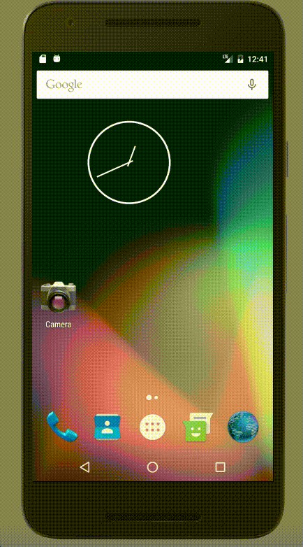

# Listify
To Do App
# Pre-work - *To Do App*

**To Do App** is an android app that allows building a todo list and basic todo items management functionality including adding new items, editing and deleting an existing item. 

Submitted by: **Gauri Gadkari**

Time spent: **48** hours spent in total

## User Stories
The following **required** functionality is completed:

* [x] User can **successfully add and remove items** from the todo list
* [x] User can **tap a todo item in the list and bring up an edit screen for the todo item** and then have any changes to the text reflected in the todo list.
* [x] User can **persist todo items** and retrieve them properly on app restart

The following **optional** features are implemented:

* [x] Persist the todo items [into SQLite](http://guides.codepath.com/android/Persisting-Data-to-the-Device#sqlite) instead of a text file
* [x] Improve style of the todo items in the list [using a custom adapter](http://guides.codepath.com/android/Using-an-ArrayAdapter-with-ListView)
* [ ] Add support for completion due dates for todo items (and display within listview item)
* [x] Use a [DialogFragment](http://guides.codepath.com/android/Using-DialogFragment) instead of new Activity for editing items
* [x] Add support for selecting the priority of each todo item (and display in listview item)
* [x] Tweak the style improving the UI / UX, play with colors, images or backgrounds

The following **additional** features are implemented:

* [x] Implemented alert dialog to confirm before deleting an item
* [x] Changed name of the app and app icon
* [x] Implemented material design floating action button
* [x] Added animation, splash screen after launching the app
* [x] User can mark items as completed using the checkbox
* [x] Changed the theme of app using material design color palette
* [x] User can share the to do list

## Video Walkthrough 

Here's a walkthrough of implemented user stories:

